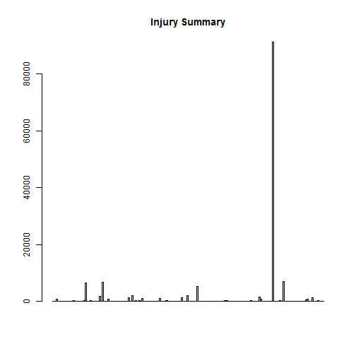
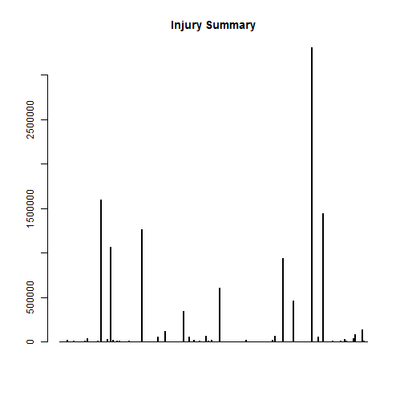

Analyze 
========================================================


Synopsis: 
----------------------------------------------------
To check population health injury of all event types, the injury variable is the only one used.
The result is plotted accordingly.
To check all type damage of all event types, PROPDMG and CROPDMG variables are the only two used
The result is plotted accordingly.

This is data reading section
----------------------------------------------------

```r

e = file.path(getwd(), "repdata-data-StormData.csv")
data = read.csv(e, header = TRUE)
```


This is data processing section
----------------------------------------------------

```r
# check population health injury of all event types
event = list(factor(data$EVTYPE))
ppldam = aggregate(x = data$INJURIES, by = event, FUN = sum)
colnames(ppldam) = c("eventtype", "injury")

most = ppldam[order(ppldam$injury, decreasing = TRUE)[1], 1]
print(paste("The type of event cause most injuries is", as.character(most)))
```

```
## [1] "The type of event cause most injuries is TORNADO"
```

```r

# check all type damage of all event types
data$damage = data$PROPDMG + data$CROPDMG
alldam = aggregate(x = data$damage, by = event, FUN = sum)
colnames(alldam) = c("eventtype", "damage")

most2 = alldam[order(alldam$damage, decreasing = TRUE)[1], 1]
print(paste("The type of event cause most damage is", as.character(most2)))
```

```
## [1] "The type of event cause most damage is TORNADO"
```


This is result section
----------------------------------------------------

```r
# figure of injury summary, exclude zero-injury event types
sortppldam = ppldam[order(-ppldam[, 2], ppldam[, 1]), ]
sortppldam2 = subset(ppldam, injury != 0)
eventname = list(sortppldam2$eventtype)
barplot(sortppldam2$injury, names.arg = eventname, main = "Injury Summary")
```

 

```r

# figure of damage summary, exclude zero-damage event types
sortalldam = alldam[order(-alldam[, 2], alldam[, 1]), ]
sortalldam2 = subset(alldam, damage != 0)
eventname = list(sortalldam2$eventtype)
barplot(sortalldam2$damage, names.arg = eventname, main = "Injury Summary")
```

 


